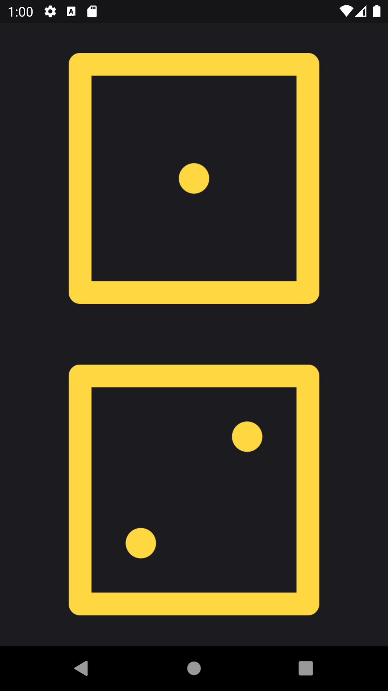
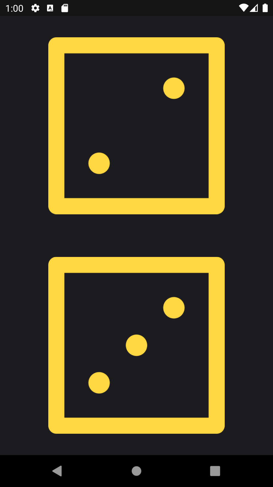

# **dice_roll**

Beginner new Flutter project.

## **About This App**

**This is a application that works like a rolling dice.**

It has one screen and shows two dice images.

When you click on one of dice face, two dice face will change.

## **Sample Picture**

---

